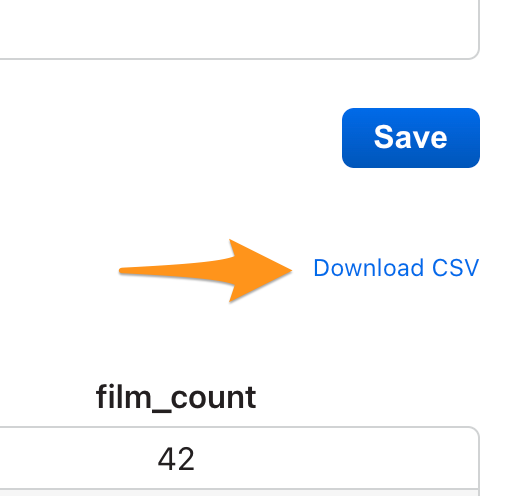
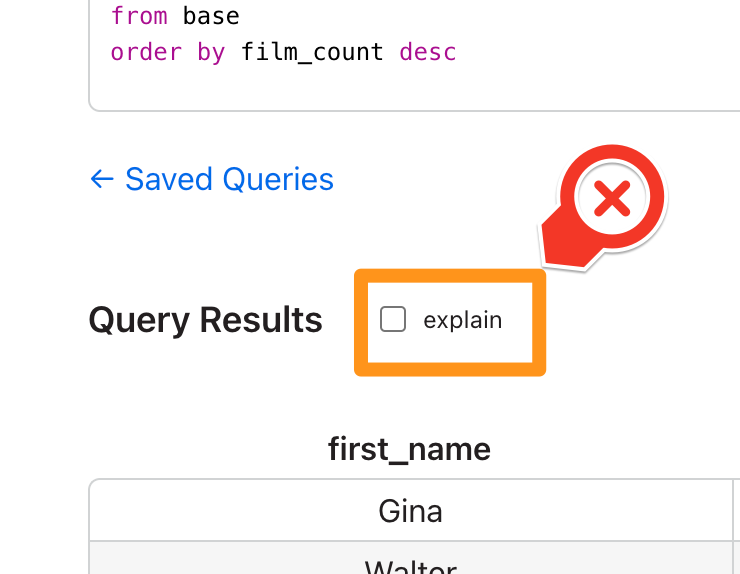
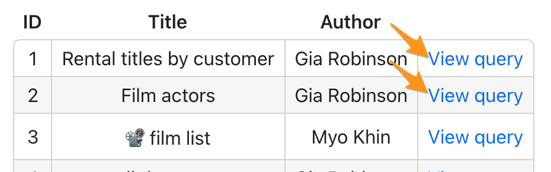
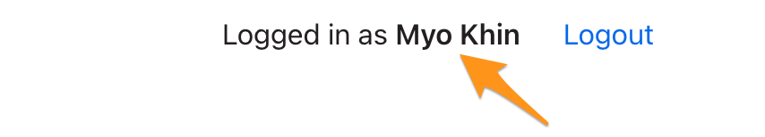

# Interview — Fullstack Django & React

## Background

Echo is a web-based app which allows users to execute, analyze and save SQL queries. Currently the app treats all users the same. But the database has some users marked as 'guest,' while others are 'editor.'

## Feature Request

We want to hide certain functionality from guest users, and upsell them on others. You will need to implement the following changes:

### Upsell

Several of the changes require an "upsell experience." We do not have an exact UI design for this. But it should prompt guest users to upgrade their account to an Editor account.

The upsell should explain that upgrading to an editor role will give the following improvements:
- Able to download CSV exports
- Can analyze queries
- Can view and execute other users' queries

The upsell should have a submit button, which needs to POST to `/upgrade/request`.

### Guests: Upsell on the Download CSV Link



For guest users, clicking the "Download CSV" link should trigger an upsell message. We want these users to upgrade their accounts to access this feature.

This should not change the experience for editor users.

### Guests: Remove "Explain" Checkbox



The "explain" feature may be confusing to guest users. So, we want this feature to be completely removed for guests.

The "explain" feature should remain for editor users.

### Guests: Cannot view other user queries



Guests sould still see that other users have saved queries, but when they click on anyone else's 'View query' link, it should trigger the upsell experience.

### Say what user role the user is logged in as



Right now we are simply printing who the user is logged in as, in the header of the app. This should be updated to also say what role (guest or editor) the user is logged in as. If the user is a guest, it should also allow them to click on the role to trigger an upsell experience.

## Development Setup

### Dependencies

- [Docker](https://docs.docker.com/get-docker/)
- [Postgres](https://www.postgresql.org/download/)
- [Node](https://nodejs.org/en/download/)
- [Yarn](https://classic.yarnpkg.com/lang/en/docs/install/#mac-stable) (can use `npm install` and `npm start` instead)

### Django Backend

The Django backend runs within a docker image.

```sh
cd ./backend/echo
docker-compose up --build
```

### React Frontend

```sh
cd ./frontend
yarn install
yarn start
```

### User Logins

Email | Password | User Type
--- | --- | ---
myo@site.com | password | guest
gia@site.com | password | editor
